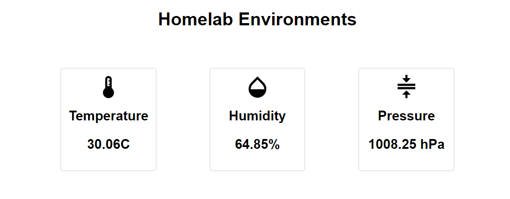

# Homelab Environments Monitor

[](https://opensource.org/licenses/MIT)

### Visit me at [MY ESP](https://env.prometheuzdy.cloud/)

## Overview

Homelab Environment Monitor is an Arduino-based project designed to provide seamless monitoring of your homelab server room environment. Using a Generic ESP8266 board and an Adafruit BME280 sensor, this solution offers an efficient way to keep track of temperature, humidity, and atmospheric pressure without the need for a real-time database like Firebase. The project leverages the ESP8266's web server capabilities to facilitate easy access to environmental data and demonstrates the principle of SSR (Server-Side Rendering).


## Features

- Web-based user interface for convenient access to real-time sensor readings.
- Utilizes Adafruit BME280 sensor for accurate and reliable environmental measurements.
- Minimalistic setup without the requirement of a real-time database.

## Repository Contents

- `mcu/mcu.ino`: Arduino sketch containing the code for the environment monitoring system.
- `mcu/data/index.html`: HTML file serving as the user interface for visualizing sensor data.
- `LICENSE`: MIT License file governing the usage of this project.

## Installation

To set up the Homelab Environment Monitor project, follow these precise steps:

1. **Install Arduino IDE**: Download and install the [Arduino IDE](https://www.arduino.cc/en/software) on your computer only 1.x will work (2023/08/07).

2. **Install Libraries**:
   - Open the Arduino IDE.
   - Go to `Sketch` > `Include Library` > `Manage Libraries`.
   - Search for and install the following libraries:
     - `Adafruit Unified Sensor` by Adafruit
     - `Adafruit BME280 Library` by Adafruit
     - `ESP8266WiFi` by ESP8266 Community

3. **Add ESP8266 Support**:
   - In the Arduino IDE, go to `File` > `Preferences`.
   - Add the following URL to the `Additional Boards Manager URLs` field:
     ```
     http://arduino.esp8266.com/stable/package_esp8266com_index.json
     ```
   - Click `OK` to save the preferences.
   - Go to `Tools` > `Board` > `Boards Manager`.
   - Search for `esp8266` and install the `esp8266` board package.
   - Select your ESP8266 board from `Tools` > `Board`.

4. **Install SPIFFS Plugin**:
   - Visit the [Arduino ESP8266 filesystem uploader plugin repository](https://github.com/esp8266/arduino-esp8266fs-plugin) for detailed installation instructions.

5. **Upload Code**:
   - Open the `mcu/mcu.ino` file in the Arduino IDE.
   - Replace `{YOUR_SSID}` and `{YOUR_PASSWORD}` with your Wi-Fi credentials.
   - Choose your ESP8266 board from `Tools` > `Board`.
   - Select the appropriate COM port from `Tools` > `Port`.
   - Upload the sketch to the ESP8266.

6. **Upload HTML**:
   - To enable the web user interface, upload the `index.html` file from the `mcu/data` folder to the ESP8266 using SPIFFS. Consult the ESP8266 documentation for step-by-step instructions.

7. **Access the Monitor**:
   - After uploading, access the user-friendly web interface by opening `http://{esp8266_ip}` in your web browser.
   - For programmatic access, retrieve sensor data via the API at `http://{esp8266_ip}/api`.

## Usage

- **Web Interface**: Access the intuitive web interface by navigating to `http://{esp8266_ip}` in your web browser. This interface presents an easy-to-read visualization of the server room environment.
- **API Access**: Obtain sensor data programmatically by making a GET request to `http://{esp8266_ip}/api`.

## Images


*Caption: Web User Interface*


*Caption: Sensor Setup on the Server (Dell PowerEdge R610)*
